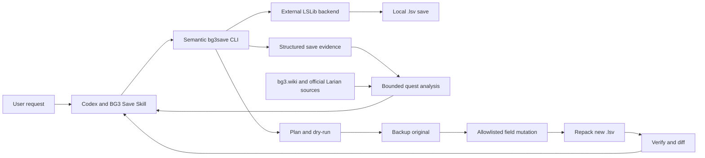

# Architecture and trust boundaries

The Agent selects a save, interprets the request, retrieves current game knowledge, and explains confidence. It does not perform binary patches. The CLI parses data, checks capabilities and arguments, makes a narrowly defined modification, and records its result deterministically. LSLib handles mature LSPK/LSF/LSMF mechanics rather than a replacement binary implementation in this project.

The package uses Python's standard library. A small .NET bridge delegates Story parsing and writing to an externally installed, license-reviewed LSLib release; dependency details belong in [dependencies.md](dependencies.md). The external tool is executed locally with argument arrays. Player saves are not uploaded to a hosted analysis service.

## Save evidence

A save is a container of resource and Story data, not a simple JSON document. `meta.lsf` carries campaign/save metadata and party summaries. `Globals.lsf`, level resources, and Story contain state of varying interpretability. Modern saves may serialize entity components into opaque ECS/LSMF payloads. An unparsed component is reported as unknown rather than reconstructed from a journal or guessed from a flag name.

Outputs preserve internal identifiers and source locations where possible. Friendly companion or quest labels are overlays, not replacements for raw evidence. Character matching must fail clearly when multiple matches are ambiguous.

## Quest analysis

The curated catalog combines observed journal steps and Story flags with Act/region, NPC and companion evidence where available. Rules include prerequisites, deadlines, mutually exclusive outcomes, and explicit unknown cases. It currently covers twenty quest/event rules across the three Acts; it is not an exhaustive BG3 quest database.

The CLI retrieves public source pages to establish provenance and freshness, with a disk cache outside the repository. It does not send save contents to the wiki. The Agent must read the relevant current pages before giving game advice, as HTTP retrieval alone does not prove a rule still matches the page. Offline output preserves source URLs but marks freshness unverified. Modded gameplay may invalidate vanilla assumptions.

See [the maintained source guide](../skills/bg3-save/references/sources.md).

## Write boundaries

Writes are semantic, explicitly allowlisted, version/field-gated operations. All current save-edit operations are experimental and require explicit opt-in. Hotbar editing changes only `MetaData/ClientDatas/ClientData`'s `HotbarLocked` boolean for a selected player slot, but its UI effect and persistence are not established: an actual false-field output loaded cleanly and a subsequent native save contained true. The cause remains unknown. Story flag edits are experimental because a quest outcome can also depend on databases, entity state, triggers, and journal records. Gold, inventory, approval and runtime NPC repair are unsupported writers in this MVP.

A modification always creates a separate output and retains a backup and manifest. Verification distinguishes container/resource integrity from in-game compatibility. The former can be automated; the latter requires loading the result in BG3. Rollback writes a restored copy from the verified backup, leaving the original untouched.

Native checksum verification uses canonical, ordinal case-insensitive full-path order; physical-order hashing remains a diagnostic and is insufficient on its own. Production repacking uses an original-archive template to retain physical and file-table layout, compression flags and supported headers. Resource conversion separately preserves the original LSF revision and metadata format.

Explicit `restore-integrity-marker` is experimental recovery for a false persisted `MetaData/Sanity` marker after canonical checksum and every-LSF parse checks. It changes no other resource fields or payload bytes and does not certify opaque ECS semantics. The ordinary writer never performs that step implicitly. A rollback reproduces the original failed marker when present, reporting its verification warning separately from exact byte restoration.

One diagnosed integrity-marker recovery was actually loaded without the warning and natively re-saved with a true marker and valid checksums on 2026-10-04. That tested case supplies the MVP's safe-repair evidence while the general operation remains experimental. The CLI still emits `game_load_validated: false`; external runtime observations belong in a separate acceptance record.
